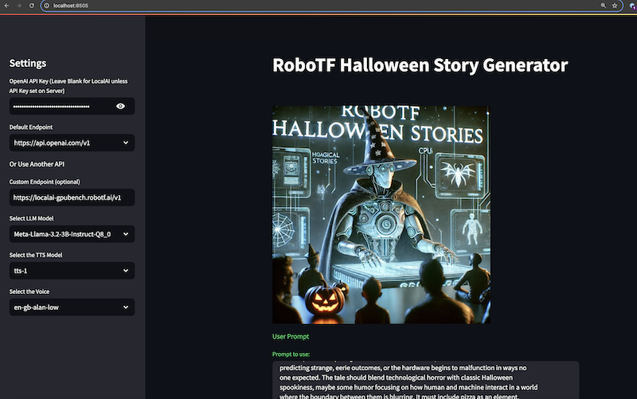
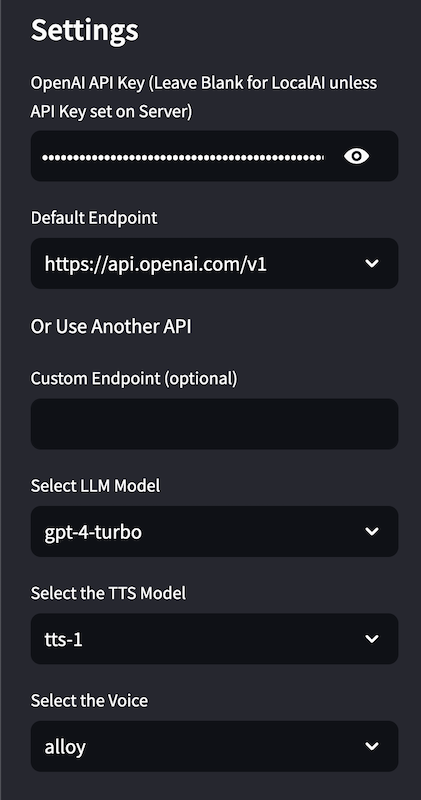
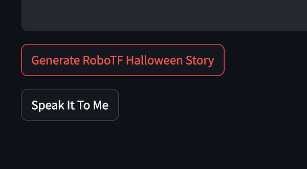

<!-- markdownlint-disable-file MD013-->
# RoboTF Halloween Stories App 🎃


Interact with a hosted version of this app live at [<https://robotf.ai/Halloween_Stories>](https://robotf.ai/Halloween_Stories)

## Table of Contents

- [Description](#description)
- [About the Project](#about-the-project-👻)
- [Features](#features-️🕯️)
- [Getting Started](#getting-started-🧹)
  - [Docker Compose with LocalAI](#option-1-local-ai-with-docker-compose-🖤)
  - [Docker from DockerHub](#option-2-docker-hub-container-👻)
  - [Direct Python Development](#option-3-local-development-👨‍💻)
- [Running the App](#running-the-app)
  - [OpenAI](#openai)
  - [Docker Compose](#docker-compose)
  - [Using LocalAI/LMStudio/Ollama/etc locally](#using-localailmstudioollamaetc-locally)
  - [Using a custom endpoint URL](#using-a-custom-endpoint-url)
- [Development Setup](#development-setup)
- [Text to Speech](#text-to-speech)
- [Contact](#contact)
- [Contributing](#contributing-👥)
- [License](#license-📜)
- [Acknowledgements](#acknowledgments-🏆)

## Description

Welcome to the eerie realm of the Spooky Streamlit Storyteller! This is no ordinary codebase; it's a haunted mansion of horror stories, where AI and LLMs (Large Language Models) come together to weave chilling tales that will send shivers down your spine. If you're brave enough to conjure up a streaming app with Streamlit that generates spooky Halloween stories, you've just unlocked the creaky front door.

In reality this is just an example of how to integrate LLM's with Streamlit using python, langchain, requests, and even LocalAI (if you don't want to waste money on OpenAI credits.). This is just a demo to show people what is possible.

## About the Project 👻

This project is a digital ouija board, channeling the supernatural power of AI to craft horror stories that are as dynamic as they are dreadful. With Streamlit's enchanting capabilities, we've bewitched an app that streams terror with the grace of a ghost gliding through the night.

## Features 🕯️

AI-Powered Storytelling: Summon the spirits of AI to generate tales of terror on the fly.

Bring your own AI/LLM with LocalAI (or other custom OpenAI compatible API) or use OpenAI

Interactive UI: Choose your own adventure by selecting story elements that shape your frightening fable.

Real-time Streaming: Experience the horror unfold in real-time as the story mutates before your terrified eyes.

Text to Speech: Don't just read it the story, hear it told to you using TTS on OpenAI or LocalAI

Halloween Humor: Because even in the darkest depths, a chuckle can be the most terrifying sound.



## Getting Started 🧹

Choose your path to horror story glory with one of these three enchanting options:

### Option 1: Local AI with Docker Compose 🖤

For the brave souls who wish to run the app with LocalAI backend using Docker Compose instead of wasting money on OpenAI credits:

Clone the Repo:

```bash
git clone https://github.com/kkacsh321/robotf_halloween_stories.git

cd robotf_halloween_stories
```

Set Up Docker Compose: Ensure you have Docker and Docker Compose installed, then run:

```bash
docker-compose up -d --build
```

Run the App:

After Docker Compose has successfully built and started the containers, navigate to <http://localhost:8505> in your web browser to experience the horror.

Set your API KEY or to 1234 for LocalAI (doesn't matter as long as not null)

OR

Set your key for OpenAI, or a custom address for your OpenAI compatiable API LLM endpoint.

**Warning LocalAI with download several models on it's first startup to handle Chat, Image Generation, etc, etc as this calls the AIO image. See more info at 

### Option 2: Docker Hub Container 👻

For those who wish to pull the pre-built container from Docker Hub:

Pull the Docker Image using latest tag (example v0.0.3):

```bash
docker pull robotf/robotf-halloween-stories:latest
```

Run the Container:

```bash
docker run -d -p 8505:8505 robotf/robotf-halloween-stories
```

Experience the Terror: Open your web browser to <http://localhost:8505> and let the horror unfold.

Set your API KEY or to 1234 for LocalAI (doesn't matter as long as not null)

OR

Set your key for OpenAI, or a custom address for your OpenAI compatiable API LLM endpoint.

### Option 3: Local Development 👨‍💻

For the storytellers who wish to tinker with the source code:

Clone the Repo:

```bash
git clone <git clone https://github.com/kkacsh321/robotf_halloween_stories.git>

cd robotf_halloween_stories

# Install Dependencies:

pip install -r requirements.txt
```

Run the App:

```bash
streamlit run RoboTF_Halloween_Stories.py
```

or using gotask

```bash
task run
```

Prepare for Chills: Follow the Streamlit link to your web browser, or navigate to the provided local URL and prepare to craft your own horror story.

Set your API KEY or to 1234 for LocalAI (doesn't matter as long as not null)

OR

Set your key for OpenAI, or a custom address for your OpenAI compatiable API LLM endpoint.

## Running the Application

This is dependant on which API provider you are going to use:

Set your specific settings (see below for basic guides)



Hit the `Generate Story` button



If you want to hear the story spoken to you, hit the `Speak it to Me` button


### OpenAI

Set your OpenAI API Key at the top left

Select your LLM model (gpt-4)

Select your TTS model (tts-1)

Select your voice (you can change this later to try multiple voices)

Hit the `Generatate Story` button and watch it go.

Once the story is done generating if you want you can hit the `Speak it to me button` to generate and play the Text to Speech.

### Docker Compose

Leave the OpenAI API Key at the top left blank

Select the `http://localai:8080/v1` endpoint (internal docker networking)

Select your LLM model (example: gpt-4)

Select your TTS model (example: tts-1)

Select your voice (you can change this later to try multiple voices)

Hit the `Generatate Story` button and watch it go.

Once the story is done generating if you want you can hit the `Speak it to me button` to generate and play the Text to Speech.

### Using LocalAI/LMStudio/Ollama/etc locally

Leave the OpenAI API Key at the top left blank

Select the `http://localai:8080/v1` endpoint (internal docker networking)

Select your LLM model (example: gpt-4)

Select your TTS model (example: tts-1)

Select your voice (you can change this later to try multiple voices)

Hit the `Generatate Story` button and watch it go.

Once the story is done generating if you want you can hit the `Speak it to me button` to generate and play the Text to Speech.

### Using a custom endpoint URL

Leave the OpenAI API Key at the top left blank

Select the `http://localai:8080/v1` endpoint (internal docker networking)

Select your LLM model (example: gpt-4)

Select your TTS model (example: tts-1)

Select your voice (you can change this later to try multiple voices)

Hit the `Generatate Story` button and watch it go.

Once the story is done generating if you want you can hit the `Speak it to me button` to generate and play the Text to Speech.

## Development Setup

This repo uses things such as precommit, task, and brew (for Mac)

Mac:
Run the setup script (if on mac with brew already installed):

```sh
./scripts/setup.sh
```

Otherwise install the required Python packages:

```sh
pip install -r requirements.txt
```

This command installs all the necessary packages, including Streamlit, langchain components, etc.

Running the App
To run the app, navigate to the app's directory in your terminal and execute the following command:

with task:

```sh
task run
```

with docker:

```sh
task docker-load && task docker-run
```

with just plain streamlit

```sh
streamlit run RoboTF_Halloween_Stories.py
```

## Text to Speech

For OpenAI select the TTS-1 model

For using LocalAI if you want extra voices, just copy the `voice_models_localai/tts-1.yaml` to the `models/` directory and startup (or restart LocalAI container).
This uses Piper under the hood with LocalAI.

Then you should be able to use the full selection of voices in the menu.

## Contact

<robot@robotf.ai>

## Contributing 👥

Want to add your own brand of terror to the mix? Contributions are welcome on this ghostly journey:

Fork the repository.
Create a new branch

```bash
git checkout -b feature/your-frightful-feature

# Make your changes.

# Commit your changes 
git commit -m 'Summon the spirits of storytelling'

# Push to the branch 
git push origin feature/your-frightful-feature

# Open a pull request and prepare to share your nightmare with the world.
```

## License 📜

This project is licensed under the MIT License - see the LICENSE file for details, but be warned: using this software may result in unintended otherworldly entanglements.

## Acknowledgments 🏆

A ghoulish nod to Streamlit for enabling us to build this haunted house of horrors.

Shoutout to LocalAI for powering my Local LLM's [localai](https://localai.io)

Kudos to the AI developers whose spectral code forms the backbone of our storytelling séance.

A special shoutout to Edgar Allan Poe and H.P. Lovecraft, whose literary shadows loom large over this project.
Final Thoughts 🎙️

As you tinker with this codebase and generate your own spine-chilling stories, remember: every tale has a grain of truth, and every shadow could be hiding something truly terrifying. Happy Haunting! 👽
